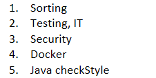

# BeerCatalouge
Rest Based approach to manage Beers using Spring Boot

#Steps to run the application
1. After cloning the code please use ``mvn clean install`` to build the project
2. Please Use ``mvn spring-boot:run`` to run the application
3. Please use the postman collection to test this applicaton

Note:- **This code is work in progress**. Due to personal situation I am not able to finish the following tasks \

Concepts used :-
1. Separation of concerns
2. Strategy pattern
3. Builder pattern
4. Dependency Injection and OOPS concepts as and where required.

NOTE:- This code is meant to be used for local development. For Production profile based parameters will be passed in respective yaml files.
